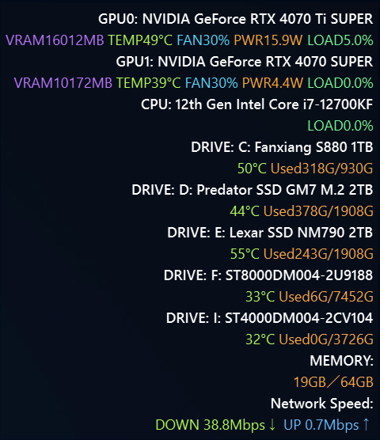

# overray-status

Windows PC の状態を表示するオーバーレイ（HUD）。GPU0, GPU1, CPU, メモリ, ネットワーク速度をリアルタイムで表示します。



## 概要

画面右上に表示される半透明のステータスバー。システムリソースをリアルタイムで確認できます。

## 機能

- GPU の表示：VRAM, TEMP, FAN, PWR, LOAD
- CPU の表示：PWR, LOAD
- メモリ：使用サイズ／最大サイズ（GB）
- ネットワーク：DOWN, UP の速度
- マザーボード名

## インストール

1. 依存関係をインストールします。

```sh
pip install -r requirements.txt
```

2. 起動スクリプトを実行します。

```sh
powershell -ExecutionPolicy Bypass -File start_overlay.ps1
```

3. 終了スクリプトを実行します。

```sh
powershell -ExecutionPolicy Bypass -File stop_overlay.ps1
```

## 使用技術

- Python 3.12+
- PySide6
- psutil
- pynvml

## ライセンス

[Apache 2.0](LICENSE)
